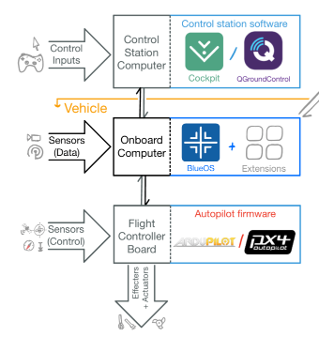
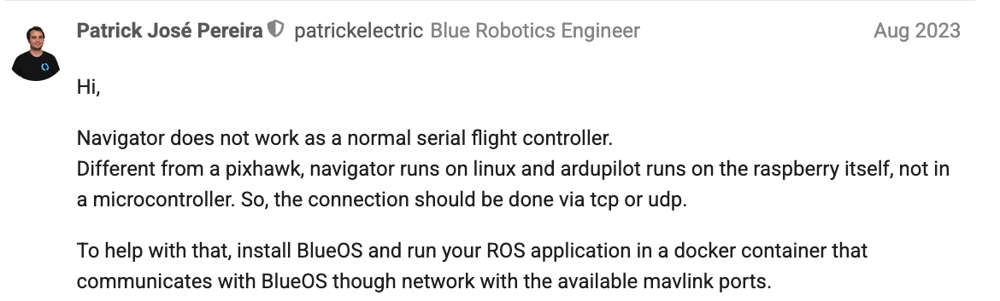

# UNDER MAINTENANCE
## BLUEROV2 EXP
This is a repo for BlueROV2 Experiments. It includes the documentation, scripts, basic codes and whatnot for deploying the BlueROV2 experiment. For simulation, please visit [here](https://github.com/HKPolyU-UAV/bluerov2).

## Disclaimer 
This practice is not optimal and all the set up is just for our convenience. For external users or our future juniors that find any better setup, feel free to launch a pull request or start a discussion, we would love that.

## Overview 
Here we provide an overview on the software architecture.
</br>


### On BlueOS
For the BlueOS to launch, there are two main containers - Bootstrap and BlueOS.

1. BlueOS - can be understood as the user interface, where you can basically monitor/setup/acquire information from the vehicle. It also provides several port service for communication, such as QGC and mavlink/mavros. 

2. Bootstrap - it is responsible for launching/updating/restarting BlueOS container; everytime the onboard computer is started, it will launch Bootstrap container (under ```/etc/rc.local```) and then the Bootstrap will then launch BlueOS. Note that we have found that the Bootstrap tends to revert BlueOS from time to time ([here](https://discuss.bluerobotics.com/t/blueos-starting-in-factory-version/14186/2)), so when you encounter any connection bugs, please make sure that you are running the correct/desired version of BlueOS.

### On Controller Firmware
Autopilot firmware could be either Ardupilot or PX4; as of 2025 May, as far as we know, PX4 only supports BlueROV2 Heavy. Here we are using Ardupilot. Unlike many quadrotor configuration, here the controller firmware is running on top of raspberry pi alongside linux, so make sure that the launch file is using tcp/udp portocol.



### On Our Container
Based on Bluerov ROS container, we

## For Data Collection
BlueROV2 has been serving our lab as the underwater platform to collect sensor data. Within the ra